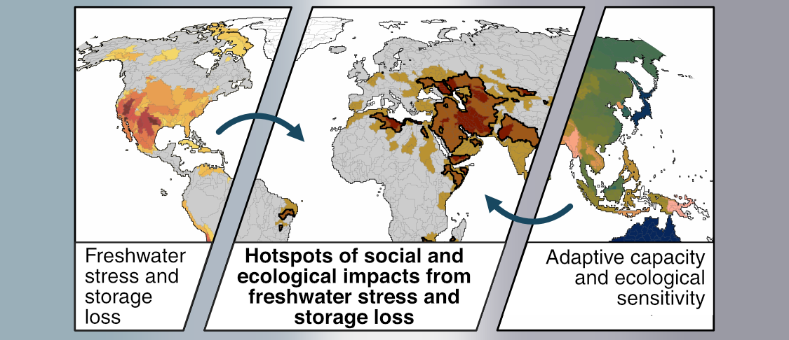

# Hotspots of social and ecological impacts from freshwater stress and storage loss

*Manuscript currently under review at Nature Communications.*  
Author list: X. Huggins, T. Gleeson, M. Kummu, S.C. Zipper, Y. Wada. T.J. Troy, J.S. Famiglietti  

## Repository structure
* **R/** -- 
    * **setup/** -- imports necessary packages and pre-sets certain plotting arguments
    * **preprocessing/** -- data preparation scripts 
    * **udfs/** -- user defined (custom) functions
    * **analysis/** -- core scripts that perform analysis and generate all plots used in manuscript figures (assembled subsequently in Affinity Designer)
* **assets/** -- holds image used as banner above
* **streamlit/** -- runs streamlit app for interactive subjectivity results (goes to sleep after consecutive days of inactivity)
